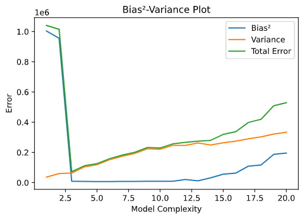

# Assignment 1 | Machine, Data and Learning

## Task 1

The function `LinearRegression().fit()` is a combination of two statements:  
- `LinearRegression()` creates an instance of the class LinearRegression which is used as our Regression model.  
        Usage: `model = LinearRegression()`  
- `fit()` is used to fit the model to the given dataset  
        Usage: `model.fit(input, output)`  

So `model = LinearRegression().fit(input, output)` creates a linear regression model and fits it to a given input and output dataset.  

`LinearRegression().fit()` fits a linear model with coefficents w = (w1, ..., wp) to minimize the residual sum of squares between the observed targets and the targets predicted by the linear approximation, i.e. Minimise the Sum of Squared Errors.

## Task 2

#### Output Table

| degree | bias | variance |
| :----: | :----: | :----: |
|        1 | 1002.12   |    36428.8 |
|        2 |  977.711  |    59290.5 |
|        3 |   93.5627 |    63145.2 |
|        4 |   87.1109 |   103549   |
|        5 |   83.2309 |   117957   |
|        6 |   83.0022 |   151206   |
|        7 |   89.8943 |   174210   |
|        8 |   88.472  |   192695   |
|        9 |   90.6972 |   223986   |
|       10 |   95.293  |   220355   |
|       11 |   95.498  |   247029   |
|       12 |  143.416  |   245812   |
|       13 |  109.394  |   262235   |
|       14 |  175.741  |   248456   |
|       15 |  236.005  |   263460   |
|       16 |  250.452  |   274580   |
|       17 |  329.727  |   289574   |
|       18 |  340.982  |   302814   |
|       19 |  432.912  |   320972   |
|       20 |  442.321  |   333111   |

#### Analysis

As functional classes change, with incresing degree we observe:
- Bias trend-
    - For degree *3*, the bias graph takes deep dive, then gradually reduces till degree *6*.
    - After that the bias unevenly increases till degree *14*.
    - Then it keeps increasing from there.
    - **Note that** just the general trend of bias falling till approximately degree *7* and then increasing is common, while the other details are case dependent.
- Variance trend:
    - It keeps increasing with some troughs till degree *11*.
    - Then it oscillates in a range of *5000* till degree *15*.
    - Then it again increases monotonicalls.
    - **Note that** just the general trend of variance rising till approximately degree *13*, not varying for another *3-4* degrees and then increasing is common, while the other details are case dependent.

## Task 3

#### Output Table

|   degree |       error |
| :----: | :----: |
|        1 | 2.32831e-10 |
|        2 | 1.16415e-10 |
|        3 | 1.45519e-11 |
|        4 | 0           |
|        5 | 0           |
|        6 | 0           |
|        7 | 0           |
|        8 | 2.91038e-11 |
|        9 | 2.91038e-11 |
|       10 | 5.82077e-11 |
|       11 | 2.91038e-11 |
|       12 | 5.82077e-11 |
|       13 | 0           |
|       14 | 1.16415e-10 |
|       15 | 0           |
|       16 | 0           |
|       17 | 0           |
|       18 | 5.82077e-11 |
|       19 | 1.16415e-10 |
|       20 | 0           |

#### Analysis and Reasoning

Observations:  
- Running the program several times shows that no general trend is followed by the irreducible error  
- All the values for the irreducible error are extremly close to each other  
- Changes in the irreducible error of a particular model after every run is extremly small  
  
Conclusions:  
- The small changes in the irreducible error values are caused by rounding errors  
- The irreducible error is equal to some value which is the same for all models  
  
Reasons:
- Irreducible errors are errors which can't be removed by any model used for prediction. These errors are caused by unknown variables that are affecting the independent/output variable, i.e. the noise in the data, but are not one of the dependent/input variable while designing the model.
- Therefore, the irreducible error represents the inherent noise in the data, and hence is irrelevant and independant of the model.

## Task 4

#### Output Graph

#### Analysis and Reasoning

From the graph plotted we can observe the following:
- Bias2 has a local minima around degree *3* and variance gradually increases, and since irreducible error is almost same, we can see that the the toal error, or mean squared error, is the least aound degree *3*.
- Therefore, the optimal model complexity is a polynomial of degree *3*.
- This would mean that for degree *1*,*2* the model underfits and from degree *4* onwards, the model overfits.
- Hence, we can say the the given data approximately forms a 3rd degree curve in the 2D Plane.