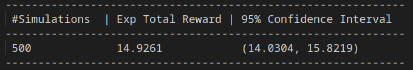
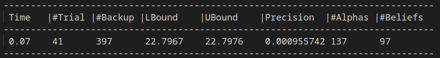

# MDL Assignment 3 Part 2

**Authors**
- Rutvij Menavlikar (2019111032)
- Tejas Chaudhari (2019111013)

---

**Position pairs for each cell on grid**
(0,0) | (1,1) | (1,2) | (1,3)
(1,0) | (1,1) | (1,2) | (1,3)
*P.S. Make a grid in latex with these pairs in them*

Let the position of the agent be (*xa*,*ya*), the position of the target be (*xt*,*yt*) and let a variable *c* be *0* when the target is not on a call and *1* when the target is on a call.
Then, the a state of the POMDP is determined by the 5-tuple (*xa*,*ya*,*xt*,*yt*,*c*).
Thus, we have *$2\times4\times2\times4\times2=128$* possible states.

The actions are **STAY, UP, DOWN, RIGHT, LEFT**.
The observations are ***o1,o2,o3,o4,o5,o6***

The roll number used for getting values of *x* and *REWARD* is ***2019111013***
So, *x*=*0.76* and *REWARD*=*83*

---

## Question 1

We are given that the target in is *(1,0)* and *o6* is observed.
Sensor accuracy while detecting *o6* is *100%*.
*o6* is observed when the target is not in the 1 cell neighbourhood of the agent.
Therefore, initially, the agent is equally likely to be in any of the cells *{(0,1),(0,2),(0,3),(1,2),(1,3)}*, and is completely unlikely to be in any other cell.
Also, for each cell the agent is likely to be in, the target is equally like to be or not to be on a call.
Thus, the start states are *{(0,1,1,0,0),(0,2,1,0,0),(0,3,1,0,0),(1,2,1,0,0),(1,3,1,0,0),(0,1,1,0,1),(0,2,1,0,1),(0,3,1,0,1),(1,2,1,0,1),(1,3,1,0,1)}* and all of them are equally likely.
Hence, the initial belief state for these states has value *0.1* and value *0* for the rest of the states.

**Start State**: *(0, 0, 0, 0, 0, 0, 0, 0, 0, 0, 0, 0, 0, 0, 0, 0, 0, 0, 0, 0, 0, 0, 0, 0, 0.1, 0.1, 0, 0, 0, 0, 0, 0, 0, 0, 0, 0, 0, 0, 0, 0, 0.1, 0.1, 0, 0, 0, 0, 0, 0, 0, 0, 0, 0, 0, 0, 0, 0, 0.1, 0.1, 0, 0, 0, 0, 0, 0, 0, 0, 0, 0, 0, 0, 0, 0, 0, 0, 0, 0, 0, 0, 0, 0, 0, 0, 0, 0, 0, 0, 0, 0, 0, 0, 0, 0, 0, 0, 0, 0, 0, 0, 0, 0, 0, 0, 0, 0, 0.1, 0.1, 0, 0, 0, 0, 0, 0, 0, 0, 0, 0, 0, 0, 0, 0, 0.1, 0.1, 0, 0, 0, 0, 0, 0)*
*P.S. Include the actual start state if text wrapping is working. Leave it otherwise*

---

## Question 2

We are given that the agent in is *(1,1)* and the target is in your one cell neighbourhood and not making a call.
Therefore, initially, the target is equally likely to be in any of the cells *{(0,1),(1,0),(1,1),(1,2)}*, and is completely unlikely to be in any other cell.
Thus, the start states are *{(1,1,0,1,0),(1,1,1,0,0),(1,1,1,1,0),(1,1,1,2,0)}* and all of them are equally likely.
Hence, the initial belief state for these states has value *0.25* and value *0* for the rest of the states.

**Start State**: *(0, 0, 0, 0, 0, 0, 0, 0, 0, 0, 0, 0, 0, 0, 0, 0, 0, 0, 0, 0, 0, 0, 0, 0, 0, 0, 0, 0, 0, 0, 0, 0, 0, 0, 0, 0, 0, 0, 0, 0, 0, 0, 0, 0, 0, 0, 0, 0, 0, 0, 0, ,0 0, 0, 0, 0, 0, 0, 0, 0, 0, 0, 0, 0, 0, 0, 0, 0, 0, 0, 0, 0, 0, 0, 0, 0, 0, 0, 0, 0, 0, 0, 0.25, 0, 0, 0, 0, 0, 0.25, 0, 0.25, 0, 0.25, 0, 0, 0, 0, 0, 0, 0, 0, 0, 0, 0, 0, 0, ,0 0, 0, 0, 0, 0, 0, 0, 0, 0, 0, 0, 0, 0, 0, 0, 0, 0, 0, 0, 0, 0)*
*P.S. Include the actual start state if text wrapping is working. Leave it otherwise*

---

## Question 3

We stored the POMDP model file in `2019111032_2019111013.pomdp` and the policy file generated by **pomdpsol** in `2019111032_2019111013.policy`
The expected utility values were calculated by running the command `./pomdpeval 2019111032_2019111013.pomdp --policy-file 2019111032_2019111013.policy --simLen 50 --simNum 500`

The expected utility values obtained from this is:
- **For Question 1:** *14.9261*
- **For Question 2:** *31.2745*

**Question 1 Output**

**Question 2 Output**

---

## Question 4

We are given that the agent in is *(0,0)* with probability *0.4*, and in *(1,3)* with probability *0.6*. And, the target is in *{(0,1),(0,2),(1,1),(1,2)}* with equal probability, i.e. *0.25*
It does not matter whether the target is on a call or not, because no observation detects it, and we are given no information about it.
Therefore, the positions of the agent and target, observation and the initial belief state value is as follows:
Positions | Observation | Probability
:-: | :-: | :-:
*((0,0),(0,1))* | *o2* | *0.1*
*((0,0),(0,2))* | *o6* | *0.1*
*((0,0),(1,1))* | *o6* | *0.1*
*((0,0),(1,2))* | *o6* | *0.1*
*((1,3),(0,1))* | *o6* | *0.15*
*((1,3),(0,2))* | *o6* | *0.15*
*((1,3),(1,1))* | *o6* | *0.15*
*((1,3),(1,2))* | *o4* | *0.15*

Let *O* be the observation observed.
Then, O can take one of the values *{o2,o4,o6}*
&#8756; *P(O=o2)=0.1*
&#8756; *P(O=o4)=0.15*
&#8756; *P(O=o6)=0.1+0.1+0.1+0.15+0.15+0.15=0.75*
Hence, ***o6*** is clearly the most like observation.

---

## Question 5

In the output in terminal after running **pomdpsol** to generate policy file, we consider the value under heading **#Trial** as our T Horizon value.

Here, *T*=*41*

Let *A* be the set of Actions, and *O* be the set of observations.
&#8756; *A*={**STAY**,**UP**,**DOWN**,**LEFT**,**RIGHT**} and *O*={*o1*,*o2*,*o3*,*o4*,*o5*,*o6*}
&#8756; *|A|*=5,*|O|*=6,*T*=41

The number of nodes *n*=$\sum_{r=0}^{T-1}|O|^r$=$\frac{|O|^T-1}{|O|-1}$
&#8756; *n*=$\frac{6^{41}-1}{6-1}$=$1.6\times10^{31}$

And, the number of policy trees *N*=$|A|^n$
&#8756; *N*=$5^{1.6\times10^{31}}\approx13^{10^{31}}$